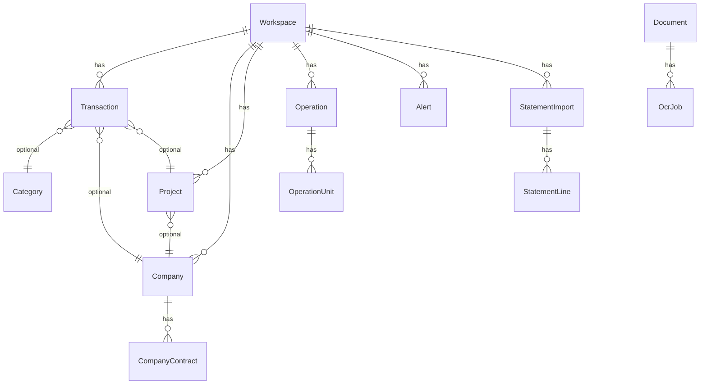

# Arquitetura Técnica — Financial Intelligence Platform

**Estrutura da plataforma (módulos, rotas, tabelas):** [PLATFORM.md](PLATFORM.md)  
**Roadmap:** [ROADMAP.md](ROADMAP.md)

## Visão geral

Plataforma SaaS multi-workspace que funciona como **CFO automatizado**, **observador financeiro** e **copiloto IA**, não como CRUD simples.

Duas superfícies de entrada:

| Superfície | Local | Autenticação |
|------------|-------|--------------|
| API REST v1 | `Modules/*/Presentation/` | Sanctum + `X-Workspace-Id` |
| Painel web | `app/Http/Controllers/Web/` | Sessão + `SetWebWorkspace` + `active.access` |

Ambas consomem os mesmos **Application Services** dos módulos — sem duplicar regras de negócio.

## Princípios

| Princípio | Implementação |
|-----------|---------------|
| SOLID | Controllers finos, Actions para casos de uso, Services para orquestração |
| DDD | Domain Events, Enums, separação por módulos |
| Desacoplamento | `AiProviderInterface`, `OcrProviderInterface`, Feature Flags |
| Escalabilidade | Filas Redis, jobs idempotentes, cache de flags |
| Segurança | RBAC, 2FA (colunas prontas), rate limit, sanitização de prompts IA |
| Auditoria | Spatie Activity Log em transações |
| Multi-tenant | `workspace_id` em modelos + middleware de isolamento |

## Módulos registrados

Ordem em `ModuleServiceProvider`:

1. **Core** — workspaces, API v1, feature flags  
2. **Finance** — transações, fluxo, previsão, extratos, CLT  
3. **Companies** — empresas, contratos  
4. **Projects** — projetos, marcos, ROI  
5. **Operations** — operações e unidades operacionais  
6. **Categorization** — categorias, regras, bulk categorize  
7. **OCR** — documentos, fila OCR, storage comprovantes  
8. **Intelligence** — IA financeira, observabilidade, assistente  
9. **Alerts** — detecção e notificações multi-canal  
10. **Integrations** — Telegram, WhatsApp, Gmail, webhooks  

## Fluxos principais

### 1. Transação com categorização automática

```
POST /transactions (web ou API)
  → CreateTransactionAction
  → CategorizationService (regras → IA → padrões default)
  → TransactionRepository / Eloquent
  → TransactionCreated event
  → CashFlowService::snapshot()
```

Bulk: `BulkCategorizeTransactionsService`, ações em lote via `TransactionBulkActionService`.

### 2. OCR assíncrono

```
POST /documents ou comprovante inbound
  → Document criado
  → ProcessOcrJob (fila: ocr)
  → OcrProvider (Tesseract/Vision)
  → Entidades extraídas → sugestão de categoria
```

Web: `ReceiptExtractController` para preview/prefill na criação de transação.

### 3. Importação e conciliação de extrato

```
POST /statements (OFX/CSV)
  → StatementImportWorkflowService
  → statement_lines criadas
  → GET .../reconcile
  → StatementLineMatcher (data, valor, descrição)
  → confirmMatch | importLine | skipLine
```

Telegram: fluxo dedicado em testes `TelegramStatementImportTest`.

### 4. Comprovante inbound (Telegram / WhatsApp)

```
Webhook / poll
  → InboundReceiptFlowService
  → OCR + ReceiptClassifier + BrazilianAmountParser
  → inbound_receipt_drafts (confirmação SIM/NÃO)
  → ReceiptConfirmationService → Transaction + Document
```

### 5. Gmail → transação

```
OAuth connect (UI)
  → gmail:sync (scheduler ou manual)
  → GmailEmailImportService
  → GmailEmailTransactionParser
  → CreateTransactionAction (deduplicação)
```

### 6. Inteligência financeira diária

```
Scheduler 06:00 — financial:daily
  → AlertDetectionService
  → CashFlowService + ForecastService
  → RunFinancialAnalysisJob (fila: ai)
  → RunObservabilityAnalysisJob
```

### 7. Assistente IA

```
POST /ai/ask (web) ou POST /api/v1/ai/assistant
  → FinancialContextBuilder
  → AiProviderManager → OpenAI/OpenRouter
  → ai_conversations / ai_messages
```

## Modelo de dados (resumo)



Schema completo: ver tabela em [PLATFORM.md](PLATFORM.md).

## Módulos e responsabilidades

### Core
- Multi-tenant: `workspaces`, `workspace_user`, `workspace_invites`
- Feature flags por workspace
- Middleware `EnsureWorkspaceAccess` (API) e `SetWebWorkspace` (web)
- Assinatura: `active.access` middleware + `subscription_profiles`

### Finance
- Contas, transações, recorrências, patrimônio (`assets`)
- Extratos: `statement_imports`, `statement_lines`, conciliação
- Salários CLT: `clt_salaries`, `clt_salary_periods`
- Snapshots de fluxo de caixa, previsões com nível de risco
- Relatórios: `FinancialReportService`
- Higiene: `DataHygieneService`

### Operations
- Operações e unidades (`operations`, `operation_units`)
- Resumo por operação: `OperationSummaryService`

### Intelligence
- Análise do ecossistema completo
- Observabilidade (logs, filas, OCR)
- Copiloto com contexto real (`FinancialContextBuilder`)

### Alerts
- Detecção programática (`AlertDetectionService`)
- Dispatch multi-canal: painel, email, Telegram, WhatsApp

### Integrations
- Telegram: poll, webhook, comandos admin (`/run daily`, etc.)
- WhatsApp: Evolution API
- Gmail: OAuth + sync
- Webhooks: `Modules/Integrations/Presentation/Routes/webhooks.php`

## Integrações (estado atual)

| Integração | Provider / service | Status |
|------------|-------------------|--------|
| OpenAI / OpenRouter | `AiProviderManager` | ✅ |
| OCR Tesseract / Vision | `OcrProviderManager` | ✅ |
| Telegram | `TelegramInboundService`, `TelegramPollService` | ✅ |
| WhatsApp Evolution | `EvolutionService`, `WhatsAppInboundService` | ✅ Opção A |
| Gmail | `GmailOAuthService`, `GmailEmailImportService` | ✅ |
| OFX / CSV | `StatementImportService` | ✅ UI + API |
| Open Finance | `integration_connections.provider` | ❌ preparado |

## Segurança IA

- Bloqueio de padrões de prompt injection em `OpenAiProvider::guardPrompt()`
- Contexto isolado por workspace
- IA nunca executa código — apenas interpreta JSON estruturado
- Feature flags desabilitam IA por workspace
- Chaves IA configuráveis por workspace (`/ai/settings`)

## Observabilidade

- Canal de log `financial`
- Horizon para métricas de filas (produção)
- `system_health_metrics` para métricas customizadas
- IA de observabilidade analisa backlog OCR e `failed_jobs`
- UI: `/observability`

## Deploy produção

```
nginx → php-fpm (app)
redis → horizon (workers: ocr, ai, notifications, default)
mysql → dados
scheduler → schedule:work (financial:daily, telegram:poll, gmail:sync)
evolution-api → WhatsApp (opcional)
```

Ver [DEPLOY.md](DEPLOY.md) e [PLATFORM.md](PLATFORM.md#operações-no-servidor).

## Extensibilidade

Para adicionar novo provedor de IA:

1. Implementar `AiProviderInterface`
2. Registrar em `AiProviderManager`
3. Configurar em `config/financial.php`

Mesmo padrão para OCR (`OcrProviderInterface`) e integrações de mensageria.

Para novo módulo de domínio:

1. Criar `Modules/{Nome}/` com camadas Domain/Application/Infrastructure/Presentation
2. Implementar `{Nome}Module` com `ModuleInterface`
3. Registrar em `ModuleServiceProvider::modules()`
