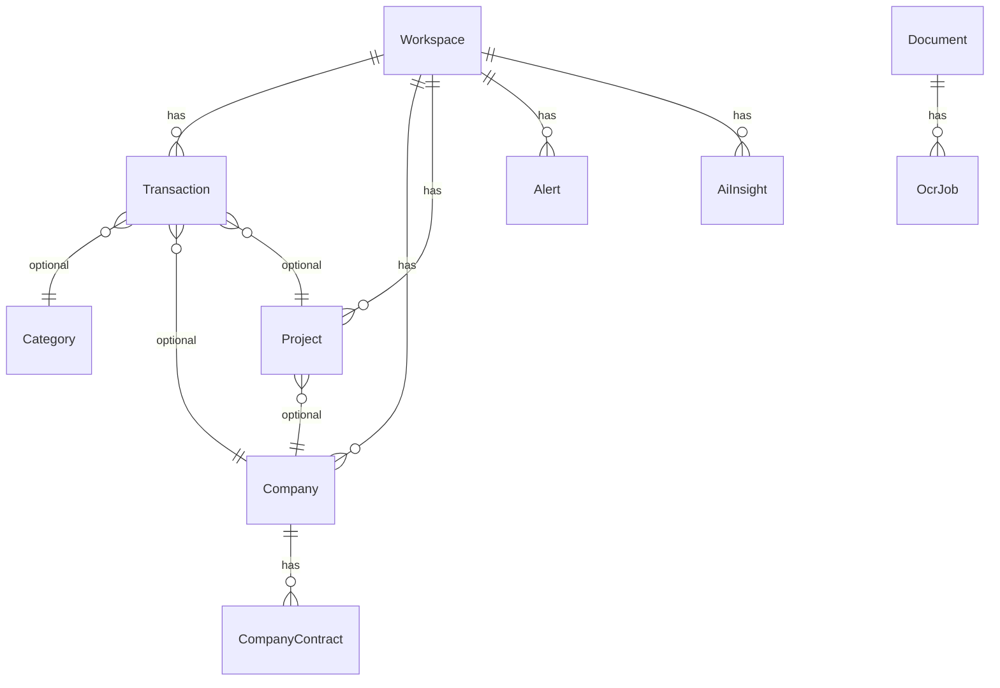

# Arquitetura Técnica — Financial Intelligence Platform

## Visão geral

Plataforma SaaS multi-workspace que funciona como **CFO automatizado**, **observador financeiro** e **copiloto IA**, não como CRUD simples.

## Princípios

| Princípio | Implementação |
|-----------|---------------|
| SOLID | Controllers finos, Actions para casos de uso, Services para orquestração |
| DDD | Domain Events, Enums, separação por módulos |
| Desacoplamento | `AiProviderInterface`, `OcrProviderInterface`, Feature Flags |
| Escalabilidade | Filas Redis, jobs idempotentes, cache de flags |
| Segurança | RBAC, 2FA, rate limit, sanitização de prompts IA |
| Auditoria | Spatie Activity Log em transações |

## Fluxos principais

### 1. Transação com categorização automática

```
POST /transactions
  → CreateTransactionAction
  → CategorizationService (regras → IA → padrões default)
  → TransactionRepository
  → TransactionCreated event
  → CashFlowService::snapshot()
```

### 2. OCR assíncrono

```
POST /documents (upload)
  → Document criado
  → ProcessOcrJob (fila: ocr)
  → OcrProvider (Tesseract/Vision)
  → Entidades extraídas → sugestão de categoria
```

### 3. Inteligência financeira diária

```
Scheduler 06:00
  → AlertDetectionService (contas, receitas, gastos, previsão)
  → CashFlowService + ForecastService
  → RunFinancialAnalysisJob (fila: ai)
  → RunObservabilityAnalysisJob (logs, filas OCR, failed_jobs)
```

### 4. Assistente IA

```
POST /ai/assistant
  → FinancialContextBuilder (transações, empresas, projetos, alertas)
  → AiProviderManager → OpenAI/OpenRouter
  → Resposta + histórico em ai_conversations
```

## Modelo de dados (resumo)



## Módulos e responsabilidades

### Core
- Multi-tenant via `workspaces` + `workspace_user`
- Feature flags por workspace
- Middleware `workspace` para isolamento

### Finance
- Contas, transações, recorrências, patrimônio (`assets`)
- Snapshots de fluxo de caixa
- Previsões com nível de risco

### Intelligence
- Análise do ecossistema completo
- Observabilidade (logs, filas, OCR)
- Copiloto com contexto real

### Alerts
- Detecção programática (regras de negócio)
- Dispatch multi-canal (painel, email, Telegram, WhatsApp)

## Integrações futuras (preparado)

- Open Finance: `integration_connections.provider = open_finance`
- Bancos: adapter pattern igual IA/OCR
- OFX/CSV: endpoint de importação (estrutura `source` em transactions)

## Segurança IA

- Bloqueio de padrões de prompt injection em `OpenAiProvider::guardPrompt()`
- Contexto isolado por workspace
- IA nunca executa código — apenas interpreta JSON estruturado
- Feature flags desabilitam IA por workspace

## Observabilidade

- Canal de log `financial`
- Horizon para métricas de filas
- `system_health_metrics` para métricas customizadas
- IA de observabilidade analisa backlog OCR e `failed_jobs`

## Deploy produção

```
nginx → php-fpm (app)
redis → horizon (workers: ocr, ai, notifications)
mysql → dados
scheduler → cron diário
```

## Extensibilidade

Para adicionar novo provedor de IA:

1. Implementar `AiProviderInterface`
2. Registrar em `AiProviderManager`
3. Configurar em `config/financial.php`

Mesmo padrão para OCR e integrações de mensageria.
