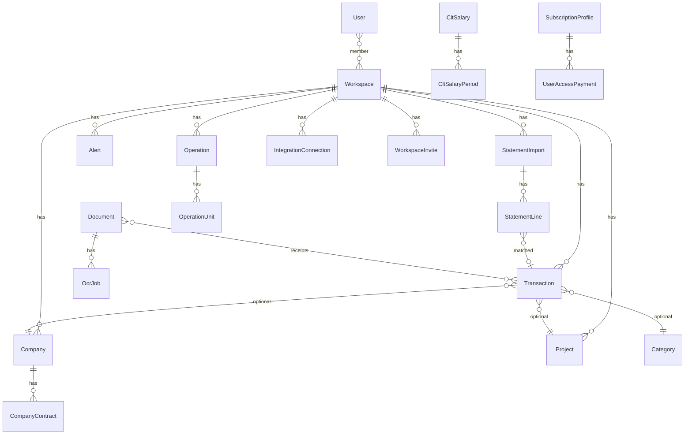

# Estrutura da plataforma — Financial Intelligence Platform

Visão consolidada da organização do código, camadas, módulos, rotas web e estado atual. Complementa [ARCHITECTURE.md](ARCHITECTURE.md) (fluxos técnicos) e [ROADMAP.md](ROADMAP.md) (próximas entregas).

**Última revisão:** maio/2026

---

## Visão do produto

SaaS **multi-workspace** que atua como CFO automatizado, observador financeiro e copiloto IA — não um CRUD de lançamentos isolado.

| Papel | Implementação principal |
|-------|-------------------------|
| CFO automatizado | `CashFlowService`, `ForecastService`, dashboard, relatórios |
| Central financeira | Transações, extratos, patrimônio, operações, salários CLT |
| Copiloto IA | Assistente, insights, análise de ecossistema |
| Observador | Alertas, observabilidade IA, filas, métricas |
| Canais externos | Telegram, WhatsApp (Evolution), Gmail (import por e-mail) |

---

## Stack

| Camada | Tecnologia |
|--------|------------|
| Backend | Laravel 13, PHP 8.3+ |
| Banco | MySQL 8 |
| Cache / filas | Redis + Horizon (dev: `database` ou `sync`) |
| Auth API | Sanctum + `X-Workspace-Id` |
| Auth web | Sessão Laravel + middleware `active.access` |
| RBAC | Spatie Permission (roles no seed; policies por recurso) |
| 2FA | Pacote instalado; colunas em `users`; fluxo web pendente |
| IA | OpenAI / OpenRouter via `AiProviderInterface` |
| OCR | Tesseract / Vision API via `OcrProviderInterface` |
| UI | AdminLTE + Bootstrap + Chart.js (`resources/views/`) |

---

## Organização do repositório

```
financial_project/
├── app/                          # Kernel Laravel + camada web
│   ├── Http/Controllers/Web/     # Painel (26 controllers)
│   ├── Http/Middleware/          # SetWebWorkspace, active.access, admin
│   ├── Application/Services/     # Serviços transversais (ex.: operações guia)
│   ├── Console/Commands/         # financial:*, telegram:*, gmail:sync
│   └── Policies/                 # Autorização workspace
├── Modules/                      # Domínio modular (ver abaixo)
├── routes/
│   ├── web.php                   # UI autenticada
│   ├── api.php                   # Login Sanctum
│   └── console.php               # Scheduler
├── resources/views/              # Blade + AdminLTE
├── database/migrations/          # Schema incremental
├── tests/                        # Feature (Phase1) + Unit
├── docs/                         # Documentação
├── scripts/                      # setup, backup, test, start/stop
└── docker-compose.yml            # app, nginx, mysql, redis, horizon, scheduler
```

---

## Módulos (`Modules/`)

Cada módulo implementa `ModuleInterface` e é registrado em `app/Providers/ModuleServiceProvider.php`.

| Módulo | Responsabilidade | Destaques |
|--------|------------------|-----------|
| **Core** | Multi-tenant, API v1, feature flags | `Workspace`, `FeatureFlag`, rotas `/api/v1` |
| **Finance** | Transações, contas, fluxo, previsão, extratos, CLT | `CreateTransactionAction`, `StatementImportService`, `CltSalaryService` |
| **Companies** | Empresas, contratos, recorrências | Tipos own / partner / payer / investment |
| **Projects** | Projetos, ROI, marcos | `ProjectMilestone` |
| **Operations** | Operações e unidades operacionais | `Operation`, `OperationUnit`, resumo por operação |
| **Categorization** | Categorias, regras, bulk categorize | Regras compartilháveis entre workspaces |
| **OCR** | Documentos, jobs OCR, storage comprovantes | `ProcessOcrJob` (fila `ocr`) |
| **Intelligence** | IA financeira, observabilidade, assistente | `FinancialIntelligenceService`, jobs fila `ai` |
| **Alerts** | Detecção e notificações | Email, Telegram, WhatsApp |
| **Integrations** | Telegram, WhatsApp, Gmail, webhooks | Inbound comprovantes, drafts, Evolution API |

### Camadas por módulo

```
Modules/{Nome}/
├── Domain/           # Events, Enums, contratos de domínio
├── Application/      # Actions, DTOs, Services, Jobs
├── Infrastructure/   # Models Eloquent, Repositories, Observers
└── Presentation/     # Controllers API, rotas do módulo
```

A **UI web** fica em `app/Http/Controllers/Web/` e consome os Services dos módulos — separação intencional entre painel e API modular.

---

## Modelo de dados (entidades principais)



### Tabelas por área (migrations)

| Área | Tabelas |
|------|---------|
| Core | `workspaces`, `workspace_user`, `workspace_invites`, `feature_flags`, `platform_settings`, `navigation_menu_items` |
| Finance | `transactions`, `financial_accounts`, `categories`, `recurring_items`, `assets`, `cash_flow_snapshots`, `financial_forecasts`, `statement_imports`, `statement_lines`, `clt_salaries`, `clt_salary_periods` |
| Empresas / projetos | `companies`, `company_contracts`, `projects`, `project_milestones` |
| Operações | `operations`, `operation_units` |
| Categorização | `categorization_rules`, `categorization_rule_assignments` |
| OCR / IA | `documents`, `ocr_jobs`, `ai_insights`, `ai_conversations`, `ai_messages` |
| Alertas | `alerts`, `alert_channels` |
| Integrações | `integration_connections`, `inbound_receipt_drafts`, `webhook_logs` |
| SaaS (parcial) | `subscription_profiles`, `user_access_payments` |
| Sistema | `system_health_metrics`, `activity_log`, Spatie `permissions` / `roles` |

---

## Rotas web (painel)

Base: autenticação + `SetWebWorkspace` + `active.access` (assinatura ativa).

| Área | Rotas | Controller |
|------|-------|------------|
| Auth | `/login`, `/register`, reset senha | `AuthController` |
| Assinatura | `/subscription/pending`, pagamento PIX | `SubscriptionPaymentController` |
| Workspace | `/workspace`, convites, reset | `WorkspaceController` |
| Dashboard | `/dashboard`, filtro período | `DashboardController` |
| Lançamentos | `/transactions` (+ bulk, comprovantes, OCR extract) | `TransactionController` |
| Extratos | `/statements`, conciliação | `StatementImportController` |
| Empresas | `/companies` | `CompanyController` |
| Projetos | `/projects` | `ProjectController` |
| Operações | `/operations` | `OperationController` |
| Salários CLT | `/clt-salaries` | `CltSalaryController` |
| Categorias / regras | `/categories`, `/categorization-rules` | `CategoryController`, `CategorizationRuleController` |
| Patrimônio | `/assets` | `AssetController` |
| Documentos | `/documents` | `DocumentController` |
| Relatórios | `/reports` | `ReportController` |
| Higiene dados | `/data-hygiene` | `DataHygieneController` |
| Alertas | `/alerts` | `AlertController` |
| IA | `/ai/assistant`, `/ai/insights`, `/ai/settings` | `AiController`, `AiSettingsController` |
| Observabilidade | `/observability` | `ObservabilityController` |
| Integrações | `/integrations/notifications`, Gmail OAuth | `IntegrationSettingsController` |
| Conta | `/account/security` (sessões, tokens API) | `AccountSecurityController` |
| Admin | `/admin/users`, `/admin/settings` | `PlatformUserController`, `PlatformSettingsController` |

Definição completa: `routes/web.php`.

---

## API REST v1

- Base: `/api/v1`
- Auth: `POST /api/auth/login` → Bearer token
- Headers: `Authorization: Bearer {token}` + `X-Workspace-Id`
- Rotas: `Modules/Core/Presentation/Routes/api.php`

| Método | Endpoint | Descrição |
|--------|----------|-----------|
| GET | `/api/v1/dashboard` | Dashboard CFO |
| CRUD | `/api/v1/transactions` | Lançamentos |
| CRUD | `/api/v1/companies` | Empresas |
| CRUD | `/api/v1/projects` | Projetos |
| GET/POST | `/api/v1/categories` | Categorias |
| GET/POST | `/api/v1/accounts` | Contas |
| GET | `/api/v1/recurring-items` | Recorrências |
| POST | `/api/v1/imports/ofx` | Import OFX |
| POST | `/api/v1/imports/csv` | Import CSV |
| GET/PATCH | `/api/v1/alerts` | Alertas |
| GET/POST | `/api/v1/ai/*` | Insights, assistente, análise |
| POST | `/api/v1/documents` | Upload OCR |

---

## Filas e jobs

| Fila | Uso |
|------|-----|
| `ocr` | `ProcessOcrJob` — documentos e comprovantes |
| `ai` | Análise ecossistema, observabilidade |
| `notifications` | `DispatchAlertJob` — email, Telegram, WhatsApp |
| `default` | Telegram poll, Evolution inbound, outros |

**Comandos Artisan:**

| Comando | Descrição |
|---------|-----------|
| `financial:daily` | Rotina 06:00 — alertas, caixa, previsão, IA |
| `financial:scan-alerts` | Somente detecção de alertas |
| `financial:normalize-workspace` | Normalização de dados |
| `telegram:poll` | Long polling (dev) |
| `telegram:webhook-sync` | Registra webhook HTTPS |
| `gmail:sync` | Importa transações de e-mails Gmail |

**Scheduler:** `routes/console.php` — `financial:daily` às 06:00; opcional `telegram:poll` e `gmail:sync` conforme `.env`.

### Operações no servidor

Substitui vários terminais `php artisan` abertos. A mesma orientação aparece no Telegram (`/ops`, `/comandos`) e em `/integrations/notifications`.

**Desenvolvimento local:**

```bash
php artisan serve
php artisan schedule:work
```

```env
TELEGRAM_SCHEDULED_POLL=true
TELEGRAM_SCHEDULED_QUEUE=true
QUEUE_CONNECTION=database   # ou sync para comprovantes na hora
TELEGRAM_INBOUND_SYNC=true
WHATSAPP_INBOUND_SYNC=true
```

O `schedule:work` dispara, a cada minuto quando configurado: `telegram:poll --once`, `queue:work --stop-when-empty` (filas `notifications`, `default`, `ocr`, `ai`) e `financial:daily` às 06:00.

**Produção (Docker):** `docker compose up -d` — serviços `horizon`, `scheduler`, `evolution-api`. Setup único: `migrate --force`, `telegram:webhook-sync`, `evolution:webhook-sync`.

**Comandos Telegram (admin — `TELEGRAM_ADMIN_CHAT_IDS`):**

| Comando | Descrição |
|---------|-----------|
| `/ops` | Status e processos necessários |
| `/poll` | Um ciclo de mensagens (dev) |
| `/fila` | Drena fila |
| `/run daily` | Inteligência diária |
| `/run alerts` | Varredura de alertas |
| `/run webhook` | Registra webhook Telegram |
| `/run evolution` | Registra webhook WhatsApp |

### Testes

Banco MySQL `financial_test` (não SQLite — falta `pdo_sqlite` neste ambiente):

```bash
bash scripts/setup-mysql-test.sh   # uma vez
./scripts/test.sh
```

Suite principal: `tests/Feature/Phase1/` + `tests/Unit/`.

---

## Integrações

| Canal | Doc | Status |
|-------|-----|--------|
| Telegram inbound + comandos | [TELEGRAM_INBOUND.md](TELEGRAM_INBOUND.md) | ✅ |
| WhatsApp Evolution (alertas + comprovante) | [WHATSAPP_EVOLUTION.md](WHATSAPP_EVOLUTION.md) | ✅ Opção A |
| Gmail OAuth + sync e-mail → transação | UI `/integrations/notifications` | ✅ |
| Open Finance / bancos | — | ❌ preparado em `integration_connections` |

---

## Documentação relacionada

| Documento | Conteúdo |
|-----------|----------|
| [ARCHITECTURE.md](ARCHITECTURE.md) | Fluxos técnicos, princípios, segurança IA |
| [ROADMAP.md](ROADMAP.md) | Fases e prioridades |
| [DEPLOY.md](DEPLOY.md) | Deploy produção |
| [DADOS_E_PRODUCAO.md](DADOS_E_PRODUCAO.md) | Backup, restore, dados |
| [TELEGRAM_INBOUND.md](TELEGRAM_INBOUND.md) | Bot Telegram |
| [WHATSAPP_EVOLUTION.md](WHATSAPP_EVOLUTION.md) | WhatsApp Evolution API |

---

## Estado resumido (maio/2026)

| Área | Progresso |
|------|-----------|
| Backend modular + API v1 | ✅ ~90% |
| Painel web AdminLTE | ✅ ~75% (falta SPA, 2FA UI, polish UX) |
| Importação / conciliação extratos | ✅ ~70% (falta PDF, IA matching, divergência saldo) |
| Integrações mensageria | ✅ ~70% (falta WhatsApp Opção B) |
| IA avançada / ML | 🟡 ~30% |
| SaaS billing enterprise | 🟡 ~25% (PIX manual + perfis; sem Stripe/SSO) |
| Testes automatizados | ✅ suite Phase1 + unit (52 arquivos) |
